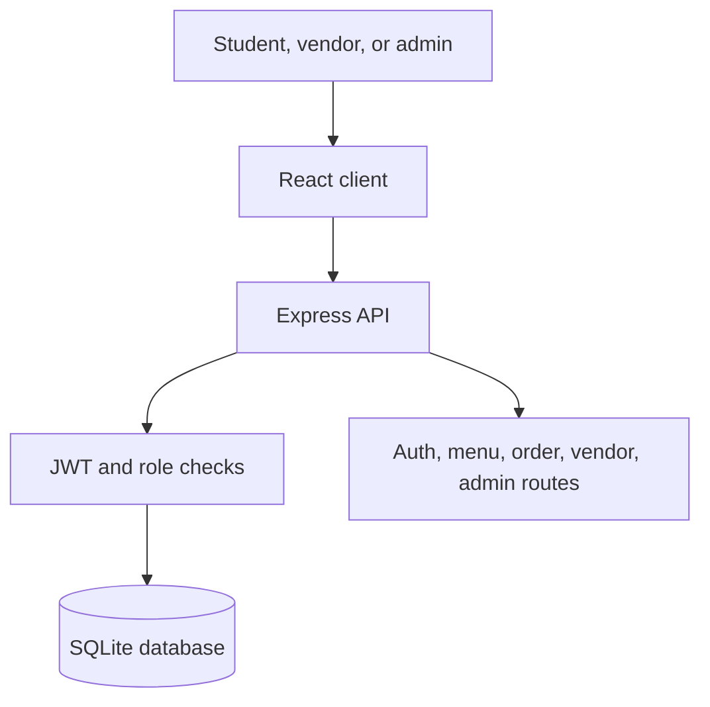

# NSU Companion

> **Smart cafeteria discovery and pre-ordering for North South University**  
> Browse live menus, skip physical queues, track preparation, and collect orders with a pickup token.

[Get started](Getting-Started) · [Use the app](User-Guide) · [Explore the API](API-Documentation) · [Contribute](Developer-Guide)

---

## Choose your path

| I am a… | Start here | Main workflow |
| --- | --- | --- |
| Student or faculty member | [User Guide — Customer](User-Guide#student--faculty-guide) | Search menu → add to cart → place order → track pickup |
| Cafeteria vendor | [User Guide — Vendor](User-Guide#vendor-guide) | Review orders → prepare → mark ready → complete |
| Administrator | [User Guide — Administrator](User-Guide#administrator-guide) | Monitor users, menu, orders, revenue, and audit logs |
| Developer | [Getting Started](Getting-Started) | Install → run client/server → verify demo flows |
| Reviewer or instructor | [Architecture](Architecture) | Review scope, roles, data model, API, and project status |

## What the system does

NSU Companion keeps one focused idea: reduce cafeteria queues through digital menu discovery and pre-ordering.

| Capability | Customer | Vendor | Admin |
| --- | :---: | :---: | :---: |
| Search and filter available menu items | ✓ | ✓ | ✓ |
| Build a cart and submit a pre-order | ✓ | — | — |
| Track order status and pickup token | ✓ | ✓ | ✓ |
| Process incoming orders | — | ✓ | ✓ |
| Manage menu availability and pricing | — | ✓ | ✓ |
| Review users, analytics, and audit logs | — | — | ✓ |

## Current implementation

| Layer | Technology | Status |
| --- | --- | --- |
| Web client | React 18, Vite, React Router, CSS | Implemented |
| API | Node.js and Express | Implemented |
| Data | SQLite | Implemented for development |
| Authentication | JWT and bcrypt | Implemented |
| Menu discovery | Search, categories, availability filtering | Implemented |
| Payments | Balance and cash workflow | Prototype |
| External gateways | SSLCommerz and bKash sandbox | Planned |
| Push notifications | Firebase Cloud Messaging | Planned |
| Production database | MySQL migration | Planned |

> Status labels distinguish runnable code from roadmap items. See the relevant page before treating a planned integration as available.

## System at a glance

## Core documentation

| Page | Use it for |
| --- | --- |
| [Getting Started](Getting-Started) | Prerequisites, installation, configuration, first run, troubleshooting |
| [User Guide](User-Guide) | Step-by-step customer, vendor, and administrator workflows |
| [Architecture](Architecture) | Components, routes, data flow, access boundaries, technical decisions |
| [API Documentation](API-Documentation) | REST endpoints and request/response examples |
| [Database Schema](Database-Schema) | Tables, relations, seed data, and indexes |
| [Developer Guide](Developer-Guide) | Branches, commits, reviews, and contribution standards |
| [Deployment Guide](Deployment-Guide) | Production build, reverse proxy, hosting, health checks, rollback |
| [Reference Adaptation](Reference-Adaptation) | What was learned from the sample and what was intentionally excluded |

## Quick verification

After following [Getting Started](Getting-Started), verify:

1. `GET /api/health` returns a successful response.
2. The menu loads and can be searched or filtered.
3. A customer can register, sign in, add an item, and place an order.
4. A vendor can advance that order through preparation statuses.
5. An administrator can view system metrics and audit activity.

## Project boundary

The [COVID-19 Help Service Application](https://github.com/Abrar-Sultan/covid-19_help_service_application) is used only as a reference for feature separation, searchable service listings, shared navigation, and role-specific workflows. NSU Companion does **not** copy its healthcare domain, Django implementation, medical data fields, assets, branding, or source code.

---

**Course:** CSE327 Software Engineering · **University:** North South University · **Status:** Active development
