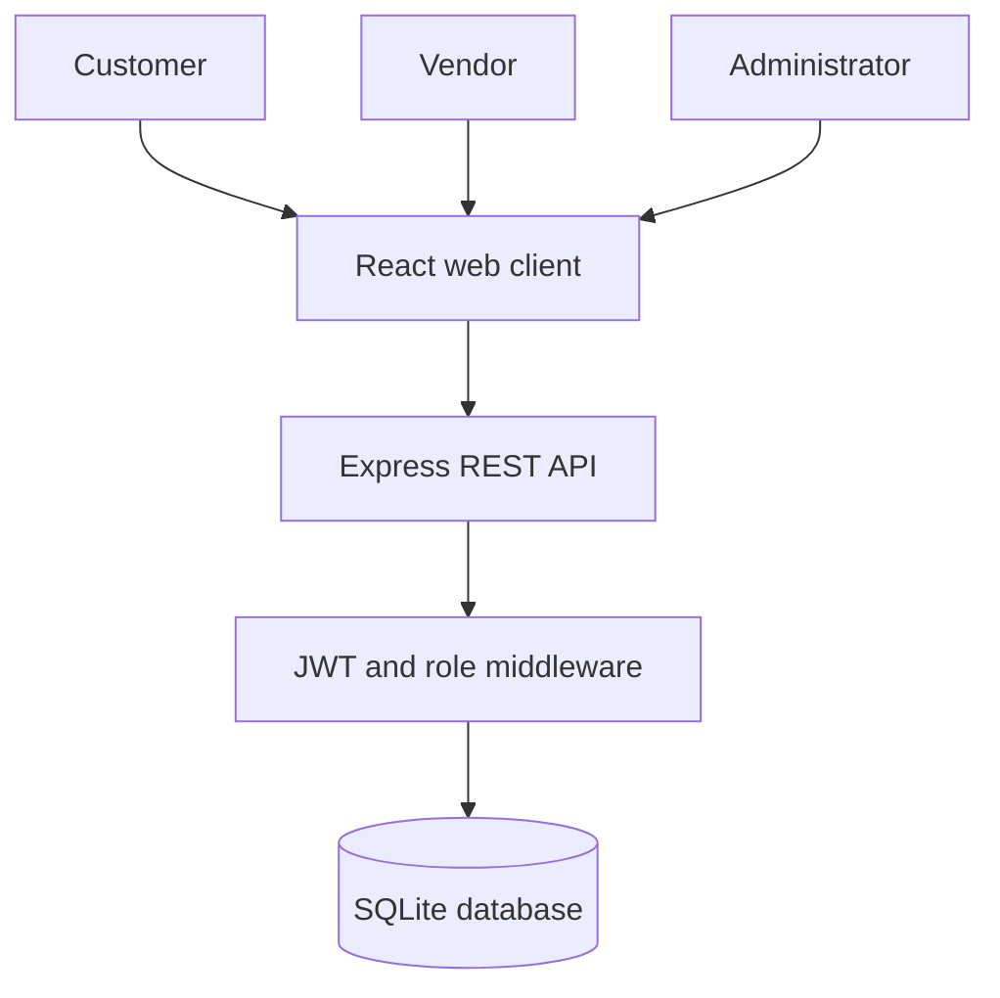
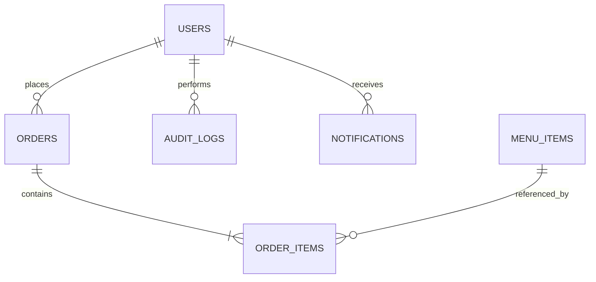
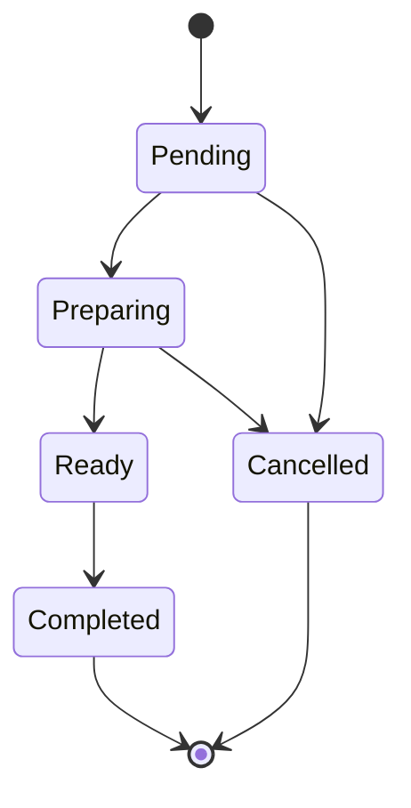

# Software Requirements Specification

## NSU Companion — Smart Cafeteria and Pre-Ordering System

| Document field | Value |
| --- | --- |
| Course | CSE327 — Software Engineering |
| Institution | North South University |
| Project | NSU Companion |
| Document version | 1.0 |
| Status | Baseline draft |
| Date | 6 August 2026 |
| Prepared by | NSU Companion Team |
| Repository | [mnxtr/Software-engineering-project](https://github.com/mnxtr/Software-engineering-project) |

### Revision history

| Version | Date | Description |
| --- | --- | --- |
| 1.0 | 6 August 2026 | Initial SRS baseline adapted to the implemented NSU Companion scope |

---

## Table of contents

1. [Introduction](#1-introduction)
2. [Overall description](#2-overall-description)
3. [System features and functional requirements](#3-system-features-and-functional-requirements)
4. [External interface requirements](#4-external-interface-requirements)
5. [Data requirements](#5-data-requirements)
6. [Non-functional requirements](#6-non-functional-requirements)
7. [Use cases](#7-use-cases)
8. [Business rules](#8-business-rules)
9. [Acceptance criteria](#9-acceptance-criteria)
10. [Traceability matrix](#10-traceability-matrix)
11. [Future scope](#11-future-scope)
12. [Appendices](#12-appendices)

---

# 1. Introduction

## 1.1 Purpose

This Software Requirements Specification defines the functional and non-functional requirements of **NSU Companion**, a web-based cafeteria menu discovery and pre-ordering system for North South University. It provides a shared baseline for students, faculty members, cafeteria vendors, administrators, developers, testers, and course reviewers.

## 1.2 Problem statement

During peak periods, customers must physically inspect menus, wait to place orders, and remain near the counter while food is prepared. Cafeteria staff must handle orders, payments, preparation status, and pickup communication at the same time. This produces avoidable queues, uncertain waiting times, and limited operational visibility.

## 1.3 Product objective

NSU Companion shall allow authenticated campus customers to discover available food, place a pre-order, track preparation, and collect it with a unique token. Vendors shall process orders and manage menu availability. Administrators shall oversee users, orders, menus, revenue summaries, and audit activity.

## 1.4 Scope

### In scope

- Customer registration and authentication
- Role-based access for customers, vendors, and administrators
- Searchable and category-filtered menu browsing
- Menu availability and pricing management
- Cart management and order placement
- Balance and cash payment workflows
- Order status tracking and pickup tokens
- Vendor order fulfilment dashboard
- Administrative statistics, user oversight, and audit logs
- Responsive browser-based access

### Out of scope for version 1.0

- Food delivery outside the NSU campus
- Nutrition or medical advice
- Healthcare or emergency-service functionality
- Production payment settlement through bKash or SSLCommerz
- Native Android or iOS applications
- Multi-university tenancy
- Automated refunds and chargebacks
- Production push notifications

## 1.5 Intended audience

| Audience | Primary use of this document |
| --- | --- |
| Project team | Implementation scope and priorities |
| Instructor/reviewer | Requirement coverage and evaluation |
| Tester | Test-case and acceptance-criteria derivation |
| Cafeteria stakeholder | Workflow and business-rule validation |
| Maintainer | Change-impact and traceability analysis |

## 1.6 Definitions and abbreviations

| Term | Meaning |
| --- | --- |
| Customer | NSU student or faculty member using the ordering service |
| Vendor | Cafeteria operator who manages fulfilment and menu availability |
| Administrator | Authorized user with system-wide oversight |
| Pickup token | Unique code used to identify an order at collection |
| JWT | JSON Web Token used for authenticated API access |
| API | Application Programming Interface |
| SPA | Single-Page Application |
| SRS | Software Requirements Specification |
| BDT / ৳ | Bangladeshi Taka |
| RBAC | Role-Based Access Control |

## 1.7 References

- [NSU Companion repository](https://github.com/mnxtr/Software-engineering-project)
- [NSU Companion architecture](../wiki/Architecture.md)
- [NSU Companion database schema](../wiki/Database-Schema.md)
- [Reference adaptation boundary](REFERENCE_ADAPTATION.md)
- [COVID-19 Help Service Application](https://github.com/Abrar-Sultan/covid-19_help_service_application), consulted only for structural patterns

---

# 2. Overall description

## 2.1 Product perspective

NSU Companion is a client-server web application. A React SPA communicates with an Express REST API. The API applies authentication and role checks before accessing the SQLite development database.

## 2.2 User classes

| User class | Characteristics | Main permissions |
| --- | --- | --- |
| Visitor | Not authenticated | View landing page, register, sign in, browse public menu |
| Customer | Registered student or faculty user | Manage cart, place orders, view own orders, manage profile/balance |
| Vendor | Authorized cafeteria staff | View incoming orders, change fulfilment status, view vendor statistics |
| Administrator | Trusted system operator | Manage menu, inspect users/orders, access statistics and audit logs |

## 2.3 Operating environment

- Modern desktop or mobile browser with JavaScript enabled
- React 18 and Vite web client
- Node.js 18 or later
- Express server
- SQLite for the current development deployment
- HTTP in local development; HTTPS required in production

## 2.4 Constraints

- The project shall retain its cafeteria and pre-ordering purpose.
- The current implementation shall use the existing React and Express architecture.
- Monetary values shall be represented in BDT.
- Protected API routes shall require a valid JWT.
- Vendor and administrator actions shall be restricted by role.
- Sensitive secrets shall be supplied through environment configuration in production.
- The academic delivery timeline and three-person team limit implementation capacity.

## 2.5 Assumptions and dependencies

- Users have network access and a supported browser.
- Vendors update order status promptly.
- Administrators maintain accurate menu prices and availability.
- The cafeteria accepts the pickup token as an order identifier.
- External payment and notification providers are dependencies only when their planned integrations are enabled.
- SQLite is sufficient for development and demonstration traffic.

## 2.6 Product status

| Capability | Status |
| --- | --- |
| React client and Express API | Implemented |
| SQLite data layer and seed data | Implemented |
| JWT authentication and RBAC | Implemented |
| Menu, cart, ordering, dashboards | Implemented/prototype |
| Balance and cash workflows | Prototype |
| bKash and SSLCommerz settlement | Planned |
| Firebase push notifications | Planned |
| MySQL production migration | Planned |

---

# 3. System features and functional requirements

The words **shall**, **should**, and **may** indicate mandatory, recommended, and optional behavior respectively.

## 3.1 Account registration and authentication

| ID | Requirement |
| --- | --- |
| FR-AUTH-01 | The system shall allow a visitor to register with name, email, password, and optional student identifier. |
| FR-AUTH-02 | The system shall reject registration when the email is already registered. |
| FR-AUTH-03 | The system shall hash passwords before storage. |
| FR-AUTH-04 | The system shall authenticate a user with email and password. |
| FR-AUTH-05 | The system shall issue a time-limited JWT after successful registration or login. |
| FR-AUTH-06 | The client shall preserve the authenticated session until logout, token expiry, or invalidation. |
| FR-AUTH-07 | The system shall return a generic authentication failure without exposing which credential was incorrect. |
| FR-AUTH-08 | The user shall be able to log out, after which the client shall remove locally stored authentication data. |

## 3.2 Authorization and roles

| ID | Requirement |
| --- | --- |
| FR-RBAC-01 | The system shall support customer, vendor, and administrator roles. |
| FR-RBAC-02 | The system shall prevent unauthenticated users from accessing cart, order-history, profile, vendor, and administrator operations. |
| FR-RBAC-03 | The system shall prevent customers from accessing vendor and administrator APIs. |
| FR-RBAC-04 | The system shall prevent vendors from accessing administrator-only operations. |
| FR-RBAC-05 | The navigation shall show actions appropriate to the authenticated user's role. |
| FR-RBAC-06 | The server shall enforce authorization independently of client-side route protection. |

## 3.3 Menu discovery

| ID | Requirement |
| --- | --- |
| FR-MENU-01 | The system shall display currently available menu items. |
| FR-MENU-02 | Each menu item shall include a name, category, price, availability state, and optional description and image. |
| FR-MENU-03 | A user shall be able to filter menu items by category. |
| FR-MENU-04 | A user shall be able to search menu items by name, description, or category. |
| FR-MENU-05 | Search shall be case-insensitive. |
| FR-MENU-06 | The interface shall report how many items match the current search and filter. |
| FR-MENU-07 | The interface shall provide clear loading, empty, and error states. |
| FR-MENU-08 | Unavailable items shall not be orderable by customers. |
| FR-MENU-09 | Public menu retrieval shall not require authentication. |

## 3.4 Menu administration

| ID | Requirement |
| --- | --- |
| FR-MGMT-01 | An authorized administrator shall be able to create a menu item. |
| FR-MGMT-02 | The system shall require a non-empty name, category, and positive numeric price. |
| FR-MGMT-03 | An authorized administrator shall be able to update item details and availability. |
| FR-MGMT-04 | An authorized administrator shall be able to delete a menu item. |
| FR-MGMT-05 | The system shall return a not-found response when the requested item does not exist. |
| FR-MGMT-06 | Changes to menu data should become visible to customers without a redeployment. |
| FR-MGMT-07 | Menu-changing actions should be recorded in the audit log. |

## 3.5 Cart management

| ID | Requirement |
| --- | --- |
| FR-CART-01 | An authenticated customer shall be able to add an available menu item to the cart. |
| FR-CART-02 | Adding the same item again shall increase its quantity rather than create an unrelated duplicate line. |
| FR-CART-03 | A customer shall be able to increase or decrease item quantity. |
| FR-CART-04 | A quantity reduced below one shall remove the item or be rejected consistently. |
| FR-CART-05 | A customer shall be able to remove an item and clear the cart. |
| FR-CART-06 | The system shall calculate the cart total from item price and quantity. |
| FR-CART-07 | The client should preserve the cart across page navigation and browser refresh. |
| FR-CART-08 | The interface shall show the number of items in the navigation cart badge. |

## 3.6 Order placement

| ID | Requirement |
| --- | --- |
| FR-ORD-01 | An authenticated customer shall be able to submit a non-empty cart as an order. |
| FR-ORD-02 | The server shall retrieve authoritative menu prices instead of trusting totals supplied by the client. |
| FR-ORD-03 | The server shall reject missing, unavailable, or invalid menu items. |
| FR-ORD-04 | The system shall support balance and cash as current payment methods. |
| FR-ORD-05 | A balance order shall be rejected when the customer's balance is insufficient. |
| FR-ORD-06 | A successful balance order shall deduct the final total atomically. |
| FR-ORD-07 | A successful order shall receive a unique pickup token. |
| FR-ORD-08 | A new order shall begin with the `pending` status. |
| FR-ORD-09 | The system shall preserve item prices at the time the order is placed. |
| FR-ORD-10 | After successful submission, the client shall clear the cart and show the customer's orders. |

## 3.7 Order tracking

| ID | Requirement |
| --- | --- |
| FR-TRACK-01 | A customer shall be able to view only their own order history. |
| FR-TRACK-02 | An order view shall display order identifier, pickup token, items, total, payment state, status, and creation time. |
| FR-TRACK-03 | Supported statuses shall include `pending`, `preparing`, `ready`, `completed`, and `cancelled`. |
| FR-TRACK-04 | The interface shall explain the current fulfilment stage. |
| FR-TRACK-05 | The customer interface should refresh order status periodically. |
| FR-TRACK-06 | A ready order shall prominently display its pickup token. |
| FR-TRACK-07 | Historical orders shall remain available after completion or cancellation. |

## 3.8 Vendor operations

| ID | Requirement |
| --- | --- |
| FR-VEND-01 | A vendor shall be able to view incoming orders. |
| FR-VEND-02 | A vendor shall be able to filter orders by status. |
| FR-VEND-03 | A vendor shall be able to move an order through valid fulfilment states. |
| FR-VEND-04 | The normal fulfilment sequence shall be pending → preparing → ready → completed. |
| FR-VEND-05 | The system shall reject an unsupported status value. |
| FR-VEND-06 | A vendor dashboard shall display order and revenue summaries. |
| FR-VEND-07 | Each vendor status change shall be attributable to the authenticated user in the audit log. |
| FR-VEND-08 | Vendor operations shall be available to administrators for oversight. |

## 3.9 Profile and balance

| ID | Requirement |
| --- | --- |
| FR-PROF-01 | An authenticated user shall be able to view their profile. |
| FR-PROF-02 | A customer profile shall display current account balance. |
| FR-PROF-03 | The prototype may allow demonstration balance top-ups. |
| FR-PROF-04 | Production balance top-ups shall require verified payment-provider confirmation before funds are credited. |
| FR-PROF-05 | The system shall reject non-numeric, zero, or negative balance adjustments. |
| FR-PROF-06 | Administrative balance adjustments shall be auditable. |

## 3.10 Administration and audit

| ID | Requirement |
| --- | --- |
| FR-ADMIN-01 | An administrator shall be able to view aggregate counts for users, menu items, and orders. |
| FR-ADMIN-02 | The dashboard shall show revenue and order-status summaries. |
| FR-ADMIN-03 | An administrator shall be able to view users and their assigned roles. |
| FR-ADMIN-04 | An administrator shall be able to inspect recent audit-log entries. |
| FR-ADMIN-05 | Audit-log retrieval shall support bounded pagination or limits. |
| FR-ADMIN-06 | Audit records shall contain actor, action, details, and timestamp when available. |
| FR-ADMIN-07 | Administrative endpoints shall require an administrator role. |
| FR-ADMIN-08 | The system shall expose a health endpoint for operational verification. |

## 3.11 Notifications

| ID | Requirement |
| --- | --- |
| FR-NOTIF-01 | The data model may store user notifications for order events. |
| FR-NOTIF-02 | The system should create a notification when an order becomes ready. |
| FR-NOTIF-03 | A user should be able to distinguish unread and read notifications. |
| FR-NOTIF-04 | Firebase push delivery is planned and shall not be treated as implemented until provider credentials, consent, and delivery handling exist. |

---

# 4. External interface requirements

## 4.1 User interface

### General

- The interface shall be usable on desktop and mobile viewports.
- Navigation shall remain consistent between authenticated pages.
- Controls shall have visible focus states and accessible labels.
- Status shall not be communicated by color alone.
- Monetary values shall include the BDT symbol or label.
- Destructive actions should require confirmation.

### Customer screens

- Landing page
- Registration and login
- Searchable menu
- Cart and checkout
- Order tracking/history
- Profile and balance

### Staff screens

- Vendor dashboard
- Administrator overview
- Menu management
- User list
- Order management
- Audit-log view

## 4.2 Software interfaces

| Interface | Requirement |
| --- | --- |
| Browser ↔ client | HTML, CSS, and JavaScript delivered over HTTP/HTTPS |
| Client ↔ API | JSON over RESTful HTTP endpoints |
| API ↔ database | Parameterized SQL queries |
| Authentication | `Authorization: Bearer <JWT>` |
| Planned payments | Provider APIs for SSLCommerz and bKash |
| Planned notifications | Firebase Cloud Messaging |

## 4.3 API behavior

- Success and failure responses shall use appropriate HTTP status codes.
- Error responses shall use a stable JSON shape containing an `error` message.
- Protected routes shall reject missing or invalid tokens with 401.
- Role violations shall return 403.
- Missing resources shall return 404.
- Validation failures shall return 400.
- Unexpected database or server errors shall return 500 without exposing secrets.

## 4.4 Communication interface

- Production traffic shall use HTTPS.
- JSON shall use UTF-8.
- The development client may proxy `/api` to the Express server.
- CORS shall be restricted to approved origins in production.

## 4.5 Hardware interface

No specialized hardware is required for version 1.0. A standard device capable of running a supported browser is sufficient. Optional future counter displays, printers, barcode scanners, or token screens require separate specifications.

---

# 5. Data requirements

## 5.1 Core entities

| Entity | Purpose |
| --- | --- |
| users | Accounts, roles, identifiers, and customer balance |
| menu_items | Food and beverage catalogue |
| orders | Order header, status, payment, total, and pickup token |
| order_items | Quantity and price snapshot for each ordered item |
| audit_logs | Security and operational accountability |
| notifications | User-facing order messages |

## 5.2 Data validation

- Email shall be unique per account.
- Role shall be one of customer, vendor, or admin.
- Price and balance values shall be numeric and non-negative; a menu price shall be greater than zero.
- Quantity shall be a positive integer.
- Order status shall be selected from the supported state list.
- Payment method shall be balance or cash until additional providers are implemented.
- Referential links shall point to existing records.
- Pickup tokens shall be unique among active orders.

## 5.3 Data retention

- Completed and cancelled orders should be retained for academic demonstration, analytics, and dispute review.
- Audit logs should be append-oriented and retained longer than normal session data.
- Authentication secrets shall never be stored in plaintext.
- Production retention periods require approval from NSU and cafeteria stakeholders.
- Users shall not be asked for medical data, national identity documents, or unrelated sensitive information.

## 5.4 Backup and recovery

- The development database should be backed up before schema changes.
- Production deployment shall define automated backups, recovery objectives, and restore tests.
- A failed order transaction shall not leave partial order items or an incorrect balance.
- Database migrations shall be versioned before a production database is introduced.

---

# 6. Non-functional requirements

## 6.1 Performance

| ID | Requirement |
| --- | --- |
| NFR-PERF-01 | Normal menu and order API requests should complete within 200 ms at the 95th percentile in the target deployment, excluding external providers. |
| NFR-PERF-02 | The primary web page should become usable within 3 seconds on a typical campus connection. |
| NFR-PERF-03 | Menu search and category filtering should provide visible results within 500 ms. |
| NFR-PERF-04 | The system should support at least 100 concurrent demonstration users without functional failure. |
| NFR-PERF-05 | Database queries used in dashboards shall be bounded and indexed when production data volume requires it. |

## 6.2 Security

| ID | Requirement |
| --- | --- |
| NFR-SEC-01 | Passwords shall be hashed with a recognized adaptive password-hashing algorithm. |
| NFR-SEC-02 | JWT signing secrets shall not be committed to source control. |
| NFR-SEC-03 | All production traffic shall use TLS. |
| NFR-SEC-04 | SQL statements shall use parameterized values. |
| NFR-SEC-05 | Authorization shall be checked on the server for every protected operation. |
| NFR-SEC-06 | Inputs shall be validated for type, length, range, and allowed values. |
| NFR-SEC-07 | Authentication and administrative endpoints should be rate-limited in production. |
| NFR-SEC-08 | Error messages and logs shall not reveal passwords, tokens, database paths, or secrets. |
| NFR-SEC-09 | Dependencies should be reviewed for known vulnerabilities before release. |

## 6.3 Reliability and availability

| ID | Requirement |
| --- | --- |
| NFR-REL-01 | Order creation and balance deduction shall behave as one atomic operation. |
| NFR-REL-02 | The service shall expose `GET /api/health` for health monitoring. |
| NFR-REL-03 | Invalid input shall not terminate the server process. |
| NFR-REL-04 | A production target of 99.5% monthly availability is desired after deployment infrastructure exists. |
| NFR-REL-05 | Recovery instructions shall support restoring the last stable release. |

## 6.4 Usability and accessibility

| ID | Requirement |
| --- | --- |
| NFR-USE-01 | A first-time customer should be able to place an order without training. |
| NFR-USE-02 | Interactive controls shall be keyboard operable. |
| NFR-USE-03 | Form inputs shall have programmatically associated labels. |
| NFR-USE-04 | Images shall have meaningful alternative text or an empty alternative when decorative. |
| NFR-USE-05 | Loading, success, empty, and failure states shall be perceivable. |
| NFR-USE-06 | The interface should meet WCAG 2.1 AA contrast and interaction guidance. |
| NFR-USE-07 | Layout shall remain functional at a 320 px viewport width. |

## 6.5 Maintainability

| ID | Requirement |
| --- | --- |
| NFR-MAIN-01 | Features shall remain separated into client pages/contexts and server route modules. |
| NFR-MAIN-02 | Repeated logic should be moved into shared services or middleware as the system grows. |
| NFR-MAIN-03 | Public functions and non-obvious business rules should be documented. |
| NFR-MAIN-04 | Changes shall follow the repository's commit and pull-request conventions. |
| NFR-MAIN-05 | Requirements, API documentation, schema documentation, and implementation shall be updated together when behavior changes. |

## 6.6 Portability and compatibility

| ID | Requirement |
| --- | --- |
| NFR-PORT-01 | The client shall support current stable Chrome, Firefox, Edge, and Safari releases. |
| NFR-PORT-02 | Development setup shall work on Windows, macOS, and Linux with Node.js 18+. |
| NFR-PORT-03 | Environment-specific values shall be configurable without editing application source. |
| NFR-PORT-04 | The development data layer may use SQLite; a production migration shall not change the user-visible domain model. |

## 6.7 Privacy

| ID | Requirement |
| --- | --- |
| NFR-PRIV-01 | The system shall collect only information necessary for identity, ordering, payment, fulfilment, and support. |
| NFR-PRIV-02 | User order history shall not be exposed to other customers. |
| NFR-PRIV-03 | Administrative access to user and order data shall be limited and auditable. |
| NFR-PRIV-04 | Healthcare, diagnostic, national-identity, or unrelated sensitive fields from the reference system shall not be introduced. |

---

# 7. Use cases

## UC-01 — Register an account

| Field | Description |
| --- | --- |
| Primary actor | Visitor |
| Preconditions | Visitor is not authenticated; email is not registered |
| Trigger | Visitor submits the registration form |
| Main flow | 1. Enter name, email, password, and optional student ID. 2. Client submits data. 3. Server validates and checks uniqueness. 4. Server hashes password and creates customer account. 5. Server returns an authenticated session. |
| Alternate flow | Duplicate email or invalid input produces a clear validation error. |
| Postconditions | Customer account exists; user is authenticated or directed to login. |

## UC-02 — Discover a menu item

| Field | Description |
| --- | --- |
| Primary actor | Visitor or customer |
| Preconditions | Menu service is available |
| Trigger | Actor opens the menu |
| Main flow | 1. System loads available items. 2. Actor searches or selects a category. 3. System filters results and announces the count. 4. Actor reviews item name, description, category, and price. |
| Alternate flow | No match shows an empty state; network failure shows retry action. |
| Postconditions | Actor identifies an orderable item or clears the filter. |

## UC-03 — Place a pre-order

| Field | Description |
| --- | --- |
| Primary actor | Customer |
| Preconditions | Customer is authenticated; cart is non-empty |
| Trigger | Customer selects Place Order |
| Main flow | 1. Review cart. 2. Select payment method. 3. Client submits item identifiers and quantities. 4. Server validates menu items and calculates total. 5. Server verifies/deducts balance when required. 6. Server creates order and items. 7. Server generates pickup token. 8. Client clears cart and shows order. |
| Alternate flow | Insufficient balance, unavailable item, or invalid quantity causes rejection without partial data changes. |
| Postconditions | A pending order with a pickup token exists. |

## UC-04 — Track an order

| Field | Description |
| --- | --- |
| Primary actor | Customer |
| Preconditions | Customer is authenticated and owns an order |
| Trigger | Customer opens order history |
| Main flow | 1. System returns the customer's orders. 2. Customer sees status, token, items, total, and payment state. 3. Client refreshes status periodically. 4. Customer collects when ready. |
| Alternate flow | No orders shows a guidance state. |
| Postconditions | Customer knows the current fulfilment status. |

## UC-05 — Fulfil an order

| Field | Description |
| --- | --- |
| Primary actor | Vendor |
| Preconditions | Vendor is authenticated; pending order exists |
| Trigger | Vendor opens dashboard |
| Main flow | 1. Filter pending orders. 2. Inspect items. 3. Mark preparing. 4. Prepare order. 5. Mark ready. 6. Verify pickup token. 7. Mark completed. |
| Alternate flow | Authorized cancellation moves the order to cancelled with an audit entry. |
| Postconditions | Order reaches completed or cancelled; changes are auditable. |

## UC-06 — Manage menu

| Field | Description |
| --- | --- |
| Primary actor | Administrator |
| Preconditions | Administrator is authenticated |
| Trigger | Administrator opens menu management |
| Main flow | 1. Add or select item. 2. Enter valid item data. 3. Save create/update/availability change. 4. System persists and returns confirmation. |
| Alternate flow | Invalid price or missing required field is rejected; missing item returns not found. |
| Postconditions | Menu reflects the authorized change. |

## UC-07 — Monitor operations

| Field | Description |
| --- | --- |
| Primary actor | Administrator |
| Preconditions | Administrator is authenticated |
| Trigger | Administrator opens dashboard |
| Main flow | 1. API aggregates users, menu items, orders, revenue, and status counts. 2. Dashboard presents metrics. 3. Administrator inspects users or audit records. |
| Alternate flow | Database failure produces a safe error without partial misleading totals. |
| Postconditions | Administrator has current operational visibility. |

---

# 8. Business rules

| ID | Rule |
| --- | --- |
| BR-01 | Only an authenticated customer may submit an order. |
| BR-02 | Only available menu items may be included in a new order. |
| BR-03 | The server-calculated price is authoritative. |
| BR-04 | A balance payment cannot reduce the customer's balance below zero. |
| BR-05 | Each order shall have one customer and at least one order item. |
| BR-06 | A pickup token shall identify one order. |
| BR-07 | The supported normal lifecycle is pending → preparing → ready → completed. |
| BR-08 | Only vendor or administrator roles may change fulfilment status. |
| BR-09 | Only an administrator may perform system-wide menu and audit operations unless permissions are deliberately revised. |
| BR-10 | Planned payment gateways and notifications shall not be represented as operational before end-to-end validation. |

---

# 9. Acceptance criteria

## 9.1 Customer acceptance

- A new user can register and authenticate.
- The menu displays only available items and supports search and category filtering.
- A customer can add items, change quantities, and see an accurate total.
- A valid order produces a pending record and unique pickup token.
- Insufficient balance prevents a balance order without corrupting balance or cart state.
- A customer cannot retrieve another customer's orders.

## 9.2 Vendor acceptance

- A vendor can view and filter orders.
- A vendor can update an order through valid statuses.
- An invalid status is rejected.
- Status changes appear to the customer and create an audit record.
- A customer cannot access vendor operations.

## 9.3 Administrator acceptance

- An administrator can view operational statistics.
- An administrator can create, update, disable, and delete menu items.
- Invalid item data is rejected.
- An administrator can inspect bounded audit-log results.
- Vendor and customer accounts cannot access administrator endpoints.

## 9.4 Quality acceptance

- Client production build completes successfully.
- Server starts and `GET /api/health` succeeds.
- Critical customer, vendor, and administrator flows pass.
- No secret is committed in configuration files.
- Keyboard navigation and responsive layout are manually verified.
- Implemented and planned capabilities remain clearly distinguished.

---

# 10. Traceability matrix

| Requirement group | Primary implementation area | Verification |
| --- | --- | --- |
| FR-AUTH, FR-RBAC | `server/src/routes/auth.js`, `server/src/middleware/auth.js`, `client/src/context/AuthContext.jsx` | API and route-access tests |
| FR-MENU, FR-MGMT | `server/src/routes/menu.js`, `client/src/pages/Menu.jsx`, admin dashboard | Search/filter and CRUD tests |
| FR-CART | `client/src/context/CartContext.jsx`, `client/src/pages/Cart.jsx` | Component/manual flow tests |
| FR-ORD, FR-TRACK | `server/src/routes/orders.js`, `client/src/pages/Orders.jsx` | Order transaction and ownership tests |
| FR-VEND | `server/src/routes/vendor.js`, `client/src/pages/VendorDashboard.jsx` | RBAC and lifecycle tests |
| FR-PROF | `server/src/routes/users.js`, profile page | Validation and ownership tests |
| FR-ADMIN | `server/src/routes/admin.js`, admin dashboard | RBAC, statistics, pagination tests |
| NFR-SEC | Middleware, route validation, environment config | Security review and negative tests |
| NFR-USE | React pages and `client/src/index.css` | Keyboard, screen-size, and state review |
| NFR-REL | Order/database logic and health endpoint | Failure-path and recovery tests |

---

# 11. Future scope

The following items require separate design, security review, provider setup, and acceptance criteria before implementation:

1. Verified bKash and SSLCommerz sandbox-to-production payment flows
2. Firebase push notifications with user consent and token lifecycle management
3. Multiple cafeteria vendors with vendor-owned menu and order partitioning
4. Time-slot capacity and order throttling during peak periods
5. QR-code pickup verification
6. Automated cancellation and refund rules
7. MySQL or managed relational database migration
8. Formal test automation, CI quality gates, and observability
9. Accessible multilingual interface, including Bangla
10. Privacy policy, retention schedule, and production incident-response process

---

# 12. Appendices

## 12.1 Requirement priority

| Priority | Meaning |
| --- | --- |
| Must | Required for the core cafeteria pre-ordering workflow |
| Should | Important for quality or operational completeness |
| Could | Valuable enhancement when time permits |
| Won't now | Explicitly excluded from the current baseline |

## 12.2 Core state model

## 12.3 Reference boundary

This SRS follows a conventional academic requirements-document structure and takes inspiration from the reference repository's separation of services, authenticated workflows, and domain entities. It does not copy the reference application's healthcare purpose, Django implementation, medical fields, branding, assets, or code. All requirements are rewritten for the NSU cafeteria domain and the existing NSU Companion architecture.
